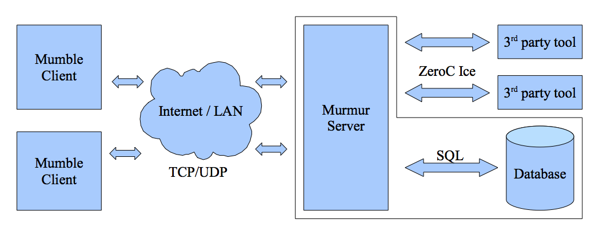
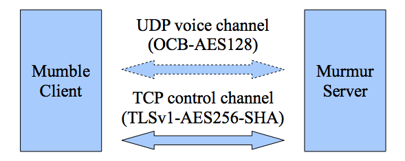

# Overview

Mumble is based on a standard server-client communication model. It
utilizes two channels of communication, the first one is a TCP connection
which is used to reliably transfer control data between the client and the
server. The second one is a UDP connection which is used for unreliable,
low latency transfer of voice data.

Both are protected by strong cryptography, this encryption is mandatory and cannot be disabled. The TCP control channel uses TLSv1 AES256-SHA[^1] while the voice channel is encrypted with OCB-AES128[^2].

While the TCP connection is mandatory the UDP connection can be compensated by tunnelling the UDP packets through the TCP connection as described in the protocol description later.

[^1]: <http://en.wikipedia.org/wiki/Transport_Layer_Security>
[^2]: <http://www.cs.ucdavis.edu/~rogaway/ocb/ocb-back.htm>
